# Signal Approximation by neural network

We will reproduce some experiment of the paper "Implicit Neural Representations with Periodic Activation Functions" (Sitzmann, Martel et al.)
https://www.vincentsitzmann.com/siren/


```python
#import packages
import numpy as np
import cv2
from matplotlib import pyplot as plt
import torch
import random
from torch.utils.data import Dataset, DataLoader, TensorDataset
import torch.nn as nn
import torch.nn.functional as F
from itertools import product

#define device to speed up on gpu, if you can
if torch.cuda.is_available():  
  dev = "cuda:0" 
else:  
  dev = "cpu"  
#dev = "cpu"

device = torch.device(dev)  
global device
print("Device :",device)

#Utils function :
#based on a model, reconstruct the image
#create the dataset based on a image file
#warning : the loss of the image is not based on the image reconstruction but based on pixel prediction

def show_image(image,index,title="Ground truth"):
    image =(image*255.0).astype(np.uint8)
    plt.figure(index)
    plt.title(title)
    plt.imshow(cv2.cvtColor(image, cv2.COLOR_BGR2RGB))
    
def reconstruct_image(model,index=0,title="Reconstruct image"):
    size_x = 256
    size_y = 256
    channels = 3
    image = np.zeros((size_x,size_y,channels))
    
    x_channel = torch.arange(0,256)/256
    y_channel = torch.arange(0,256)/256

    x_channel = x_channel.view(-1,1)
    y_channel = y_channel.view(1,-1)

    x_channel = x_channel.repeat(1, 256)
    y_channel = y_channel.repeat(256, 1)

    x_channel = x_channel.view(-1)
    y_channel = y_channel.view(-1)


    xy_channel = torch.stack([x_channel,y_channel],dim=-1)
    raw_image = model(xy_channel).cpu()
    image = torch.reshape(raw_image, (size_x,size_y,3)).detach().numpy()


    show_image(image,index,title)
    
def create_dataset(image):#dataset with r,g,b in [0,1]
    size_x = image.shape[0]
    size_y = image.shape[1]
    channels = image.shape[2]
    
    x_data = np.zeros((size_x*size_y,2))
    y_labels = np.zeros((size_x*size_y,channels))
    for i in range(size_x):
        for j in range(size_y):
            x_ = i/size_x
            y_ = j/size_y
            #print([x_,y_])
            #print(y_labels.shape)
            x_data[i*size_y+j] = [x_,y_]
            y_labels[i*size_y+j] = image[i][j]/255.0
    return x_data,y_labels


#The models to predict, based on the data (coordinate (x,y)), the label (pixel (r,g,b))

#by Vincent Sitzmann, Implicit Neural Representations with Periodic Activation Functions
#https://www.vincentsitzmann.com/siren/
class SineLayer(nn.Module):

    def __init__(self, in_features, out_features, bias=True,
                 is_first=False, omega_0=30):
        super().__init__()
        self.omega_0 = omega_0
        self.is_first = is_first
        
        self.in_features = in_features
        self.linear = nn.Linear(in_features, out_features, bias=bias).to(device)
        
        self.init_weights()
    
    def init_weights(self):
        with torch.no_grad():
            if self.is_first:
                self.linear.weight.uniform_(-1 / self.in_features, 
                                             1 / self.in_features)      
            else:
                self.linear.weight.uniform_(-np.sqrt(6 / self.in_features) / self.omega_0, 
                                             np.sqrt(6 / self.in_features) / self.omega_0)
        
    def forward(self, input):
        return torch.sin(self.omega_0 * self.linear(input))
    
class Siren(nn.Module):
    def __init__(self, in_features, hidden_features, hidden_layers, out_features, outermost_linear=False, 
                 first_omega_0=30, hidden_omega_0=30.):
        super().__init__()
        
        self.net = []
        self.net.append(SineLayer(in_features, hidden_features, 
                                  is_first=True, omega_0=first_omega_0))

        for i in range(hidden_layers):
            self.net.append(SineLayer(hidden_features, hidden_features, 
                                      is_first=False, omega_0=hidden_omega_0))

        if outermost_linear:
            final_linear = nn.Linear(hidden_features, out_features)
            
            with torch.no_grad():
                final_linear.weight.uniform_(-np.sqrt(6 / hidden_features) / hidden_omega_0, 
                                              np.sqrt(6 / hidden_features) / hidden_omega_0)
                
            self.net.append(final_linear)
        else:
            self.net.append(SineLayer(hidden_features, out_features, 
                                      is_first=False, omega_0=hidden_omega_0))
        
        self.net = nn.Sequential(*self.net)
    
    def forward(self, coords):
        coords = coords.to(device)
        coords = coords.clone().detach().requires_grad_(True) # allows to take derivative w.r.t. input
        output = self.net(coords)
        return output#, coords        

    def forward_with_activations(self, coords, retain_grad=False):
        '''Returns not only model output, but also intermediate activations.
        Only used for visualizing activations later!'''
        activations = OrderedDict()

        activation_count = 0
        x = coords.clone().detach().requires_grad_(True)
        activations['input'] = x
        for i, layer in enumerate(self.net):
            if isinstance(layer, SineLayer):
                x, intermed = layer.forward_with_intermediate(x)
                
                if retain_grad:
                    x.retain_grad()
                    intermed.retain_grad()
                    
                activations['_'.join((str(layer.__class__), "%d" % activation_count))] = intermed
                activation_count += 1
            else: 
                x = layer(x)
                
                if retain_grad:
                    x.retain_grad()
                    
            activations['_'.join((str(layer.__class__), "%d" % activation_count))] = x
            activation_count += 1

        return activations
    
    
#based on David Brellmann, "Fourier Features in Reinforcement Learning with Neural Networks"
#https://openreview.net/forum?id=VO7bAwdWRjg
class fourier_extract_full(nn.Linear):
    def __init__(self, in_features:int, order:int):
        self.order = order
        self.in_features = in_features
        super().__init__(in_features, (order+1)**in_features, bias=True)
        c=np.array(list(product(range(order + 1), repeat=in_features)))
        with torch.no_grad():
            self.weight.copy_(torch.tensor(c, dtype=torch.float32))
        self.weight.requires_grad = False

    def get_output_size(self,):
        return (self.order+1)**self.in_features

    def forward(self, x:torch.Tensor)->torch.Tensor:
        ##print(x.size())
        x = x.to(device)
        x = np.pi*super().forward(x)
        return torch.cos(x)
    
    
#code by me
class simple_mlp(nn.Module):
    def __init__(self,):
        super(simple_mlp, self).__init__()
        self.fc_1 = nn.Linear(2,64).to(device)
        self.fc_2 = nn.Linear(64,64).to(device)
        self.fc_3 = nn.Linear(64,3).to(device)

    def forward(self, x):
        x = x.to(device)
        x = F.relu(self.fc_1(x))
        x = F.relu(self.fc_2(x))
        x = self.fc_3(x)
        return x
    
#code by me, based on fourier_extract_full
class fourier_mlp(nn.Module):
    def __init__(self,):
        super(fourier_mlp, self).__init__()
        self.fourier_1 = fourier_extract_full(2,8).to(device)
        self.fc_2 = nn.Linear(self.fourier_1.get_output_size(),64).to(device)
        self.fc_3 = nn.Linear(64,64).to(device)
        self.fc_4 = nn.Linear(64,3).to(device)

    def forward(self, x):
        x = x.to(device)
        x = self.fourier_1(x)
        x = F.relu(self.fc_2(x))
        x = F.relu(self.fc_3(x))
        x = self.fc_4(x)
        return x
    
#code by me, based on Siren
class siren_mlp(nn.Module):
    def __init__(self,):
        super(siren_mlp, self).__init__()
        #sorry for this litle trick, the original paper predict only one value
        self.siren_r = Siren(in_features=2, out_features=1, hidden_features=64, hidden_layers=1, outermost_linear=True).to(device)
        self.siren_g = Siren(in_features=2, out_features=1, hidden_features=64, hidden_layers=1, outermost_linear=True).to(device)
        self.siren_b = Siren(in_features=2, out_features=1, hidden_features=64, hidden_layers=1, outermost_linear=True).to(device)

    def forward(self,x):
        x = x.to(device)
        return torch.cat([self.siren_r(x),self.siren_g(x),self.siren_b(x),],dim=-1)
    
    
#code by me
class triangular_features_extraction(nn.Linear):
    def __init__(self, in_features:int, order:int,flatten=True):
        self.flatten = flatten
        self.order = order
        self.in_features = in_features
        self.size_ecart = 1/(self.order-1)
        self.var_power = 2.0
        
        self.size_pic = self.var_power*self.size_ecart

        super().__init__(in_features, (order)*in_features, bias=True)


    def forward(self, x:torch.Tensor)->torch.Tensor:
        x = x.type(torch.float64).to(device)
        out= torch.zeros(x.shape[0],x.shape[1],self.order).to(device)

        
        for i in range(self.order):
            out[:,:,i] = x-i*self.size_ecart
        mean = self.size_pic
        out = torch.min(torch.relu(out+self.size_pic),torch.relu(self.size_pic-out)).to(device)/(self.size_pic)
        
        
        if self.flatten:
            return torch.flatten(out, start_dim=1)
        else:
            return out#torch.flatten(out, start_dim=1)

#code by me
class triangular_mlp(nn.Module):
    def __init__(self,):
        super(triangular_mlp, self).__init__()
        self.triangular_extraction = triangular_features_extraction(2,8).to(device)
        self.fc_1 = nn.Linear(16,64).to(device)
        self.fc_2 = nn.Linear(64,3).to(device)
        #self.fc_3 = nn.Linear(64,3).to(device)

    def forward(self, x):
        x = x.to(device)
        x = self.triangular_extraction(x)
        x = F.relu(self.fc_1(x))
        #x = F.relu(self.fc_2(x))
        x = self.fc_2(x)
        return x
        
#we define the trainning loop
def train_model(
    model=simple_mlp(),
    dataset=create_dataset(cv2.imread("lena.png")),
    epochs=10,
    plot_step=1,
    ):
    loss_func = torch.nn.MSELoss()
    dataset = TensorDataset( torch.Tensor(dataset[0]), torch.Tensor(dataset[1]) )
    dataloader = DataLoader(dataset, batch_size=1024, shuffle=True)
    optimizer = torch.optim.Adam(model.parameters(), lr=0.001)
    loss_array = []


    for epoch in range(epochs):

        for id_batch, (inputs, labels) in enumerate(dataloader):
                optimizer.zero_grad()
                labels_predict = model(inputs).cpu()
                loss_train = loss_func(labels_predict, labels)
                loss_train.backward()
                optimizer.step()
                loss_array.append(loss_train.detach().numpy())
                #print(id_batch)
                if id_batch==0:
                    if epoch%plot_step==0:
                        print('Epoch: %d, Loss_train: %.3f ' % (epoch+1, loss_train))
    plt.figure(42)
    plt.title("Loss curve")
    plt.xlabel("Trainning")
    plt.ylabel("Loss")
    plt.plot(loss_array)
    print("Finished with a loss for 100 last loss : ",np.mean(loss_array[-100:]))
    print("Finished with a loss for 50 last loss : ",np.mean(loss_array[-50:]))
    


```

    Device : cuda:0


# We will benchmark different way to extract the data to obtain the pixel prediction

The extraction :


```python
layer = triangular_features_extraction(100,8,flatten=False)
input_x = torch.arange(0,100)/100
input_x = input_x.view(1,-1)
output_y = layer(input_x).cpu()
plt.title("Triangular extraction visualization")
plt.plot(output_y[0])

```


    [<matplotlib.lines.Line2D at 0x7f6cc4227940>,
     <matplotlib.lines.Line2D at 0x7f6cc42279a0>,
     <matplotlib.lines.Line2D at 0x7f6cc42279d0>,
     <matplotlib.lines.Line2D at 0x7f6cc4227af0>,
     <matplotlib.lines.Line2D at 0x7f6cc4227be0>,
     <matplotlib.lines.Line2D at 0x7f6cc4227cd0>,
     <matplotlib.lines.Line2D at 0x7f6cc4227dc0>,
     <matplotlib.lines.Line2D at 0x7f6cc4227eb0>]


    

    


```python
layer = fourier_extract_full(1,4).to(device)

input_x = torch.arange(0,100)/100
input_x = input_x.view(1,-1,1).to(device)
print(input_x.shape)
output_y = layer(input_x).cpu()
plt.title("Fourier feature extraction visualization")
plt.plot(output_y[0].detach().numpy())
```

    torch.Size([1, 100, 1])


    [<matplotlib.lines.Line2D at 0x7f6cc1577e80>,
     <matplotlib.lines.Line2D at 0x7f6cc1577ee0>,
     <matplotlib.lines.Line2D at 0x7f6cc1577f10>,
     <matplotlib.lines.Line2D at 0x7f6cc1586040>,
     <matplotlib.lines.Line2D at 0x7f6cc1586130>]


    

    


```python
layer = SineLayer(1,4).to(device)

input_x = torch.arange(0,100)/100
input_x = input_x.view(1,-1,1).to(device)
print(input_x.shape)
output_y = layer(input_x).cpu()
plt.title("Siren extraction visualization")
plt.plot(output_y[0].detach().numpy())
```

    torch.Size([1, 100, 1])


    [<matplotlib.lines.Line2D at 0x7f6cc1495430>,
     <matplotlib.lines.Line2D at 0x7f6cc1495490>,
     <matplotlib.lines.Line2D at 0x7f6cc14954c0>,
     <matplotlib.lines.Line2D at 0x7f6cc14955b0>]


    
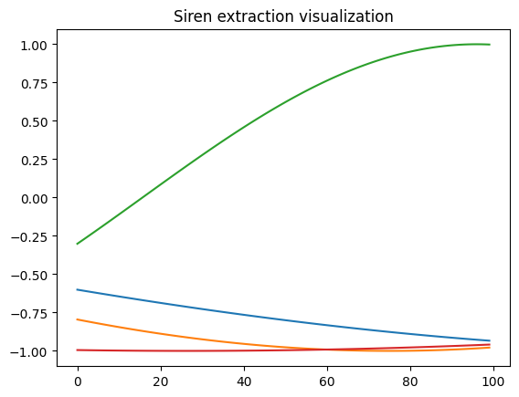
    


The test of the model :


```python
#Verify all model and show data
model = simple_mlp()
reconstruct_image(model,1,"SimpleMlp Image Reconstruct")

model = fourier_mlp()
reconstruct_image(model,2,"FourierMlp Image Reconstruct")

model = siren_mlp()
reconstruct_image(model,3,"SirenMlp Reconstruct")

model = triangular_mlp()
reconstruct_image(model,4,"TriangularMlp Reconstruct")


```


    

    


    
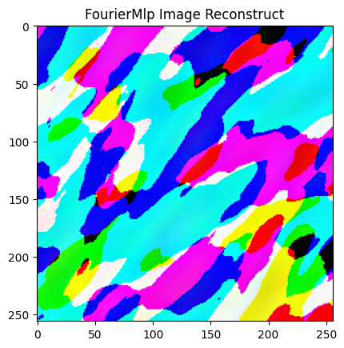
    


    

    


    

    


The data :


```python
show_image(cv2.imread("lena.png")/255.0,5)
```


    

    


# Result of the image prediction


```python
model = simple_mlp()
train_model(model)
reconstruct_image(model,1,"SimpleMlp Image Reconstruct")
print(model)
```

    Epoch: 1, Loss_train: 0.375 
    Epoch: 2, Loss_train: 0.028 
    Epoch: 3, Loss_train: 0.025 
    Epoch: 4, Loss_train: 0.023 
    Epoch: 5, Loss_train: 0.022 
    Epoch: 6, Loss_train: 0.020 
    Epoch: 7, Loss_train: 0.018 
    Epoch: 8, Loss_train: 0.019 
    Epoch: 9, Loss_train: 0.017 
    Epoch: 10, Loss_train: 0.015 
    Finished with a loss for 100 last loss :  0.014891304
    Finished with a loss for 50 last loss :  0.014766498
    simple_mlp(
      (fc_1): Linear(in_features=2, out_features=64, bias=True)
      (fc_2): Linear(in_features=64, out_features=64, bias=True)
      (fc_3): Linear(in_features=64, out_features=3, bias=True)
    )


    

    


    

    


```python
model = fourier_mlp()
train_model(model)
reconstruct_image(model,2,"FourierMlp Reconstruct")
print(model)
```

    Epoch: 1, Loss_train: 0.281 
    Epoch: 2, Loss_train: 0.009 
    Epoch: 3, Loss_train: 0.008 
    Epoch: 4, Loss_train: 0.006 
    Epoch: 5, Loss_train: 0.005 
    Epoch: 6, Loss_train: 0.005 
    Epoch: 7, Loss_train: 0.005 
    Epoch: 8, Loss_train: 0.004 
    Epoch: 9, Loss_train: 0.004 
    Epoch: 10, Loss_train: 0.004 
    Finished with a loss for 100 last loss :  0.0036816054
    Finished with a loss for 50 last loss :  0.003639353
    fourier_mlp(
      (fourier_1): fourier_extract_full(in_features=2, out_features=81, bias=True)
      (fc_2): Linear(in_features=81, out_features=64, bias=True)
      (fc_3): Linear(in_features=64, out_features=64, bias=True)
      (fc_4): Linear(in_features=64, out_features=3, bias=True)
    )


    

    


    

    


```python
model = siren_mlp()
train_model(model)
reconstruct_image(model,4,"SirenMlp Reconstruct")
print(model)
```

    Epoch: 1, Loss_train: 0.283 
    Epoch: 2, Loss_train: 0.007 
    Epoch: 3, Loss_train: 0.006 
    Epoch: 4, Loss_train: 0.007 
    Epoch: 5, Loss_train: 0.006 
    Epoch: 6, Loss_train: 0.005 
    Epoch: 7, Loss_train: 0.004 
    Epoch: 8, Loss_train: 0.005 
    Epoch: 9, Loss_train: 0.005 
    Epoch: 10, Loss_train: 0.005 
    Finished with a loss for 100 last loss :  0.0047096624
    Finished with a loss for 50 last loss :  0.00461373
    siren_mlp(
      (siren_r): Siren(
        (net): Sequential(
          (0): SineLayer(
            (linear): Linear(in_features=2, out_features=64, bias=True)
          )
          (1): SineLayer(
            (linear): Linear(in_features=64, out_features=64, bias=True)
          )
          (2): Linear(in_features=64, out_features=1, bias=True)
        )
      )
      (siren_g): Siren(
        (net): Sequential(
          (0): SineLayer(
            (linear): Linear(in_features=2, out_features=64, bias=True)
          )
          (1): SineLayer(
            (linear): Linear(in_features=64, out_features=64, bias=True)
          )
          (2): Linear(in_features=64, out_features=1, bias=True)
        )
      )
      (siren_b): Siren(
        (net): Sequential(
          (0): SineLayer(
            (linear): Linear(in_features=2, out_features=64, bias=True)
          )
          (1): SineLayer(
            (linear): Linear(in_features=64, out_features=64, bias=True)
          )
          (2): Linear(in_features=64, out_features=1, bias=True)
        )
      )
    )


    
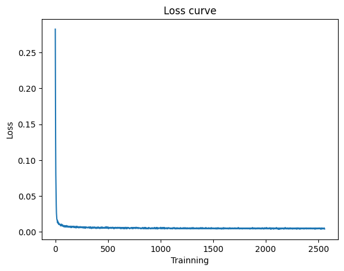
    


    
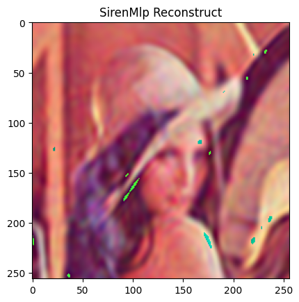
    


```python
model = triangular_mlp()
train_model(model)
reconstruct_image(model,4,"TriangularMlp Reconstruct")
print(model)

```

    Epoch: 1, Loss_train: 0.304 
    Epoch: 2, Loss_train: 0.020 
    Epoch: 3, Loss_train: 0.018 
    Epoch: 4, Loss_train: 0.016 
    Epoch: 5, Loss_train: 0.014 
    Epoch: 6, Loss_train: 0.014 
    Epoch: 7, Loss_train: 0.014 
    Epoch: 8, Loss_train: 0.012 
    Epoch: 9, Loss_train: 0.012 
    Epoch: 10, Loss_train: 0.013 
    Finished with a loss for 100 last loss :  0.011705444
    Finished with a loss for 50 last loss :  0.011567899
    triangular_mlp(
      (triangular_extraction): triangular_features_extraction(in_features=2, out_features=16, bias=True)
      (fc_1): Linear(in_features=16, out_features=64, bias=True)
      (fc_2): Linear(in_features=64, out_features=3, bias=True)
    )


    

    


    
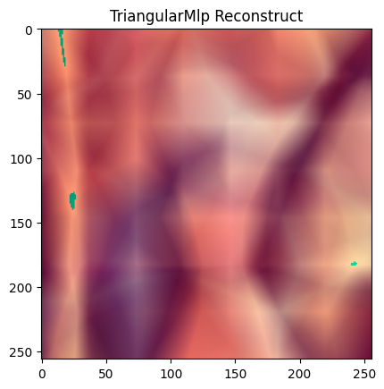
    


# After the image reconstruction, the 2D signal reconstruction :

### 


```python

def show_data(data,labels,index,title="Ground truth",size=128):
    X,Y,Z = data[:,0],data[:,1],labels

    X = np.reshape(X,(size,size))
    Y = np.reshape(Y,(size,size))
    Z = np.reshape(Z,(size,size))
    
    fig = plt.figure(index,figsize=(4, 4))
    #plt.title(title)
    fig.suptitle(title)
    ax = fig.add_subplot()
    scats = ax.scatter(X,Y,c=Z, cmap = "RdBu")#RdBu
    #fig.colorbar(scats)
    
def reconstruct_Helmholtz(model,index=1,title="Reconstruct image",size=128):
    size_x = size
    size_y = size
    channels = 1
    
    
    image = np.zeros((size_x,size_y,channels))
    x_channel = (torch.arange(0,size_x)/size_x)*2 -1
    y_channel = (torch.arange(0,size_y)/size_y)*2 -1
    x_channel = x_channel.view(-1,1)
    y_channel = y_channel.view(1,-1)
    x_channel = x_channel.repeat(1, size_x)
    y_channel = y_channel.repeat(size_y, 1)

    x_channel = x_channel.view(-1)
    y_channel = y_channel.view(-1)


    xy_channel = torch.stack([x_channel,y_channel],dim=-1)
    raw_image = model(xy_channel).cpu()

    show_data(xy_channel.detach(),raw_image.detach(),index,title,size)
    
    

def create_dataset_Helmholtz(size=128,size_sin=4):
    size_x=size
    size_y=size
    x_data = np.zeros((size_x*size_y,2))
    y_labels = np.zeros((size_x*size_y,1))
    for i in range(size_x):
        for j in range(size_y):
            x_ = (i/size_x)*2-1
            y_ = (j/size_y)*2-1

            x_data[i*size_y+j] = [x_,y_]
            R = np.sqrt((x_)**2 + y_**2)
            y_labels[i*size_y+j] = np.sin(R*3.1415*size_sin) 
    return x_data,y_labels
def create_dataset_Helmholtz_max(size=128):
    return create_dataset_Helmholtz(size=128,size_sin=10)


def create_dataset_hard(size=128):
    size_x=size
    size_y=size
    x_data = np.zeros((size_x*size_y,2))
    y_labels = np.zeros((size_x*size_y,1))
    for i in range(size_x):
        for j in range(size_y):
            x_ = (i/size_x)*2-1
            y_ = (j/size_y)*2-1

            x_data[i*size_y+j] = [x_,y_]
            y_labels[i*size_y+j] = np.sin(3.1415*(2*x_+3*y_)*2*x_+random.random())
            
            
    return x_data,y_labels


```

The 2D signal to Reconstruct :


```python
(data,label) = create_dataset_Helmholtz(size=128)
show_data(data,label,1,size=128)
```


    

    


To solve this task, we can choose between 2 types of neural network :

    minimal : Obtain reconstruction with the smaller model to see the benefits and limits of each way to extract the data
    maximal : Obtain a reconstruction with the higher accuracy (with bigger model), to test the model on harder task after that


```python
#Minimal neural network
class simple_mlp_Helmholtz(nn.Module):
    def __init__(self,):
        super(simple_mlp_Helmholtz, self).__init__()
        self.fc_1 = nn.Linear(2,32).to(device)
        self.fc_2 = nn.Linear(32,1).to(device)
    def forward(self, x):
        x = x.to(device)
        x = F.relu(self.fc_1(x))
        x = self.fc_2(x)
        return x
    
class triangular_mlp_Helmholtz(nn.Module):
    def __init__(self,):
        super(triangular_mlp_Helmholtz, self).__init__()
        self.input_decompo = triangular_features_extraction(2,8).to(device)
        self.fc_1 = nn.Linear(16,1).to(device)
        #self.fc_2 = nn.Linear(32,1).to(device)


    def forward(self, x):
        x = x.to(device)
        x = self.input_decompo((x+1)/2)
        #x = F.relu(self.fc_1(x))
        x = self.fc_1(x)
        return x
#code by me
class fourier_mlp_Helmholtz(nn.Module):
    def __init__(self,):
        super(fourier_mlp_Helmholtz, self).__init__()
        self.fourier_1 = fourier_extract_full(2,4).to(device)
        self.fc_2 = nn.Linear(self.fourier_1.get_output_size(),1).to(device)
        #self.fc_3 = nn.Linear(64,1).to(device)


    def forward(self, x):
        x = x.to(device)
        x = self.fourier_1(x)
        #x = F.relu(self.fc_2(x))
        x = self.fc_2(x)
        return x
    
#code by me
class siren_mlp_Helmholtz(nn.Module):
    def __init__(self,):
        super(siren_mlp_Helmholtz, self).__init__()
        self.siren = Siren(in_features=2, out_features=1, hidden_features=16, hidden_layers=0, outermost_linear=False).to(device)

    def forward(self,x):
        x = x.to(device)
        return self.siren(x)
    

```


```python
#Normal model
class simple_mlp_Helmholtz(nn.Module):
    def __init__(self,):
        super(simple_mlp_Helmholtz, self).__init__()
        self.fc_1 = nn.Linear(2,32).to(device)
        self.fc_2 = nn.Linear(32,32).to(device)
        self.fc_3 = nn.Linear(32,1).to(device)
    def forward(self, x):
        x = x.to(device)
        x = F.relu(self.fc_1(x))
        x = F.relu(self.fc_2(x))
        x = self.fc_3(x)
        return x
    
class siren_fake_mlp_Helmholtz(nn.Module):
    def __init__(self,):
        super(siren_fake_mlp_Helmholtz, self).__init__()
        self.fc_1 = nn.Linear(2,32).to(device)
        self.fc_2 = nn.Linear(32,32).to(device)
        self.fc_3 = nn.Linear(32,1).to(device)
    def forward(self, x):
        x = x.to(device)
        x = torch.sin(self.fc_1(x))
        x = torch.sin(self.fc_2(x))
        x = self.fc_3(x)
        return x
    
class triangular_mlp_Helmholtz(nn.Module):
    def __init__(self,):
        super(triangular_mlp_Helmholtz, self).__init__()
        self.input_decompo = triangular_features_extraction(2,8).to(device)
        self.fc_1 = nn.Linear(16,32).to(device)
        self.fc_2 = nn.Linear(32,1).to(device)


    def forward(self, x):
        x = x.to(device)
        x = self.input_decompo((x+1)/2)
        x = F.relu(self.fc_1(x))
        x = self.fc_2(x)
        return x
    
    
#code by me
class fourier_mlp_Helmholtz(nn.Module):
    def __init__(self,):
        super(fourier_mlp_Helmholtz, self).__init__()
        self.fourier_1 = fourier_extract_full(2,8).to(device)
        self.fc_2 = nn.Linear(self.fourier_1.get_output_size(),32).to(device)
        self.fc_3 = nn.Linear(32,1).to(device)


    def forward(self, x):
        x = x.to(device)
        x = self.fourier_1(x)
        x = F.relu(self.fc_2(x))
        x = self.fc_3(x)
        return x
    
#code by me
class siren_mlp_Helmholtz(nn.Module):
    def __init__(self,):
        super(siren_mlp_Helmholtz, self).__init__()
        self.siren = Siren(in_features=2, out_features=1, hidden_features=32, hidden_layers=1, outermost_linear=False).to(device)

    def forward(self,x):
        x = x.to(device)
        return self.siren(x)
    
```


```python
#Verify models and data 
model = simple_mlp_Helmholtz()
reconstruct_Helmholtz(model,index=1)

model = fourier_mlp_Helmholtz()
reconstruct_Helmholtz(model,index=2)

model = siren_mlp_Helmholtz()
reconstruct_Helmholtz(model,index=3)

model = triangular_mlp_Helmholtz()
reconstruct_Helmholtz(model,index=4)


(data,label) = create_dataset_Helmholtz(size=128)
show_data(data,label,5,size=128)

```


    

    


    

    


    

    


    

    


    
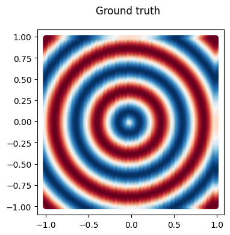
    


# Result of the 2D signal approximation, easy version


```python
#Simple data
(data,label) = create_dataset_Helmholtz(size=128)
show_data(data,label,5,size=128)
```


    

    


```python
model = simple_mlp_Helmholtz()
train_model(model,create_dataset_Helmholtz(),epochs=500,plot_step=50)
reconstruct_Helmholtz(model,index=1,title="SimpleMLP Sinus Reconstruction")
print(model)
```

    Epoch: 1, Loss_train: 0.490 
    Epoch: 51, Loss_train: 0.373 
    Epoch: 101, Loss_train: 0.232 
    Epoch: 151, Loss_train: 0.107 
    Epoch: 201, Loss_train: 0.065 
    Epoch: 251, Loss_train: 0.042 
    Epoch: 301, Loss_train: 0.034 
    Epoch: 351, Loss_train: 0.030 
    Epoch: 401, Loss_train: 0.026 
    Epoch: 451, Loss_train: 0.023 
    Finished with a loss for 100 last loss :  0.023761917
    Finished with a loss for 50 last loss :  0.023563698
    simple_mlp_Helmholtz(
      (fc_1): Linear(in_features=2, out_features=32, bias=True)
      (fc_2): Linear(in_features=32, out_features=32, bias=True)
      (fc_3): Linear(in_features=32, out_features=1, bias=True)
    )


    
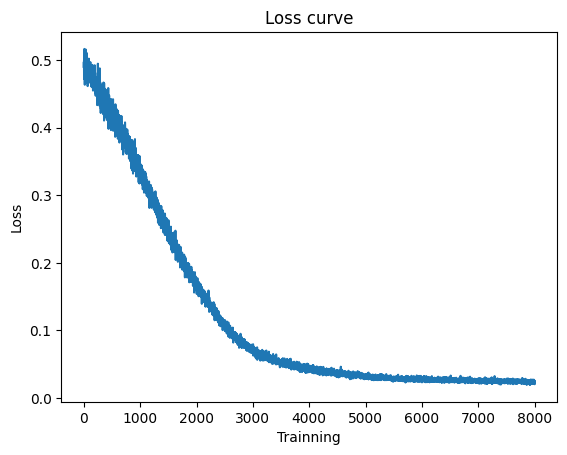
    


    

    


```python
model = siren_fake_mlp_Helmholtz()
train_model(model,create_dataset_Helmholtz(),epochs=500,plot_step=50)
reconstruct_Helmholtz(model,index=1,title="SirenFakeMLP Sinus Reconstruction")
print(model)
```

    Epoch: 1, Loss_train: 0.527 
    Epoch: 51, Loss_train: 0.497 
    Epoch: 101, Loss_train: 0.475 
    Epoch: 151, Loss_train: 0.478 
    Epoch: 201, Loss_train: 0.498 
    Epoch: 251, Loss_train: 0.452 
    Epoch: 301, Loss_train: 0.479 
    Epoch: 351, Loss_train: 0.460 
    Epoch: 401, Loss_train: 0.432 
    Epoch: 451, Loss_train: 0.370 
    Finished with a loss for 100 last loss :  0.32091698
    Finished with a loss for 50 last loss :  0.31662843
    siren_fake_mlp_Helmholtz(
      (fc_1): Linear(in_features=2, out_features=32, bias=True)
      (fc_2): Linear(in_features=32, out_features=32, bias=True)
      (fc_3): Linear(in_features=32, out_features=1, bias=True)
    )


    

    


    

    


```python

model = fourier_mlp_Helmholtz()
train_model(model,create_dataset_Helmholtz(),epochs=500,plot_step=50)
reconstruct_Helmholtz(model,index=2,title="FourierMLP Sinus Reconstruction")
print(model)
```

    Epoch: 1, Loss_train: 0.509 
    Epoch: 51, Loss_train: 0.001 
    Epoch: 101, Loss_train: 0.001 
    Epoch: 151, Loss_train: 0.000 
    Epoch: 201, Loss_train: 0.000 
    Epoch: 251, Loss_train: 0.000 
    Epoch: 301, Loss_train: 0.000 
    Epoch: 351, Loss_train: 0.000 
    Epoch: 401, Loss_train: 0.000 
    Epoch: 451, Loss_train: 0.000 
    Finished with a loss for 100 last loss :  0.00023157937
    Finished with a loss for 50 last loss :  0.00023680594
    fourier_mlp_Helmholtz(
      (fourier_1): fourier_extract_full(in_features=2, out_features=81, bias=True)
      (fc_2): Linear(in_features=81, out_features=32, bias=True)
      (fc_3): Linear(in_features=32, out_features=1, bias=True)
    )


    
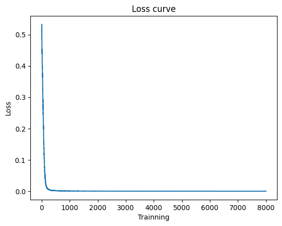
    


    

    


```python
model = siren_mlp_Helmholtz()
train_model(model,create_dataset_Helmholtz(),epochs=500,plot_step=50)
reconstruct_Helmholtz(model,index=4,title="SirenMLP Sinus Reconstruction")
print(model)
```

    Epoch: 1, Loss_train: 1.144 
    Epoch: 51, Loss_train: 0.002 
    Epoch: 101, Loss_train: 0.001 
    Epoch: 151, Loss_train: 0.002 
    Epoch: 201, Loss_train: 0.003 
    Epoch: 251, Loss_train: 0.001 
    Epoch: 301, Loss_train: 0.001 
    Epoch: 351, Loss_train: 0.001 
    Epoch: 401, Loss_train: 0.001 
    Epoch: 451, Loss_train: 0.001 
    Finished with a loss for 100 last loss :  0.0010300127
    Finished with a loss for 50 last loss :  0.0010263402
    siren_mlp_Helmholtz(
      (siren): Siren(
        (net): Sequential(
          (0): SineLayer(
            (linear): Linear(in_features=2, out_features=32, bias=True)
          )
          (1): SineLayer(
            (linear): Linear(in_features=32, out_features=32, bias=True)
          )
          (2): SineLayer(
            (linear): Linear(in_features=32, out_features=1, bias=True)
          )
        )
      )
    )


    

    


    
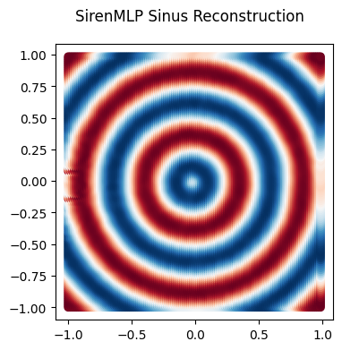
    


```python
model = triangular_mlp_Helmholtz()
train_model(model,create_dataset_Helmholtz(),epochs=500,plot_step=50)
reconstruct_Helmholtz(model,index=5,title="TriangularMLP Sinus Reconstruction")
print(model)
```

    Epoch: 1, Loss_train: 0.502 
    Epoch: 51, Loss_train: 0.109 
    Epoch: 101, Loss_train: 0.021 
    Epoch: 151, Loss_train: 0.011 
    Epoch: 201, Loss_train: 0.008 
    Epoch: 251, Loss_train: 0.008 
    Epoch: 301, Loss_train: 0.006 
    Epoch: 351, Loss_train: 0.006 
    Epoch: 401, Loss_train: 0.005 
    Epoch: 451, Loss_train: 0.005 
    Finished with a loss for 100 last loss :  0.0049856286
    Finished with a loss for 50 last loss :  0.004961751
    triangular_mlp_Helmholtz(
      (input_decompo): triangular_features_extraction(in_features=2, out_features=16, bias=True)
      (fc_1): Linear(in_features=16, out_features=32, bias=True)
      (fc_2): Linear(in_features=32, out_features=1, bias=True)
    )


    

    


    

    


# Result of the 2D signal approximation,  moderate version


```python
#moderate data
(data,label) = create_dataset_Helmholtz_max(size=128)
show_data(data,label,5,size=128)
```


    
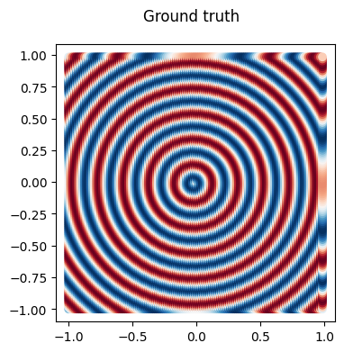
    


```python
model = simple_mlp_Helmholtz()
train_model(model,create_dataset_Helmholtz_max(),epochs=500,plot_step=50)
reconstruct_Helmholtz(model,index=1,title="SimpleMLP Sinus Reconstruction")
print(model)
```

    Epoch: 1, Loss_train: 0.565 
    Epoch: 51, Loss_train: 0.532 
    Epoch: 101, Loss_train: 0.494 
    Epoch: 151, Loss_train: 0.498 
    Epoch: 201, Loss_train: 0.496 
    Epoch: 251, Loss_train: 0.490 
    Epoch: 301, Loss_train: 0.501 
    Epoch: 351, Loss_train: 0.490 
    Epoch: 401, Loss_train: 0.499 
    Epoch: 451, Loss_train: 0.475 
    Finished with a loss for 100 last loss :  0.48520267
    Finished with a loss for 50 last loss :  0.4854953
    simple_mlp_Helmholtz(
      (fc_1): Linear(in_features=2, out_features=32, bias=True)
      (fc_2): Linear(in_features=32, out_features=32, bias=True)
      (fc_3): Linear(in_features=32, out_features=1, bias=True)
    )


    

    


    

    


```python
model = fourier_mlp_Helmholtz()
train_model(model,create_dataset_Helmholtz_max(),epochs=500,plot_step=50)
reconstruct_Helmholtz(model,index=2,title="FourierMLP Sinus Reconstruction")
print(model)
```

    Epoch: 1, Loss_train: 0.515 
    Epoch: 51, Loss_train: 0.016 
    Epoch: 101, Loss_train: 0.006 
    Epoch: 151, Loss_train: 0.006 
    Epoch: 201, Loss_train: 0.004 
    Epoch: 251, Loss_train: 0.004 
    Epoch: 301, Loss_train: 0.004 
    Epoch: 351, Loss_train: 0.003 
    Epoch: 401, Loss_train: 0.003 
    Epoch: 451, Loss_train: 0.003 
    Finished with a loss for 100 last loss :  0.0035549884
    Finished with a loss for 50 last loss :  0.0035740403
    fourier_mlp_Helmholtz(
      (fourier_1): fourier_extract_full(in_features=2, out_features=81, bias=True)
      (fc_2): Linear(in_features=81, out_features=32, bias=True)
      (fc_3): Linear(in_features=32, out_features=1, bias=True)
    )


    
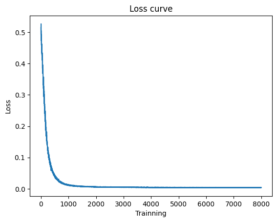
    


    
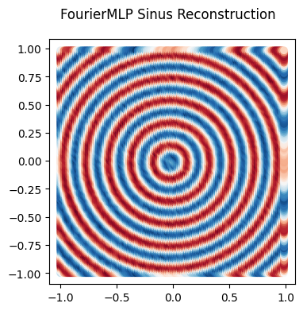
    


```python
model = siren_mlp_Helmholtz()
train_model(model,create_dataset_Helmholtz_max(),epochs=500,plot_step=50)
reconstruct_Helmholtz(model,index=4,title="SirenMLP Sinus Reconstruction")
print(model)
```

    Epoch: 1, Loss_train: 0.986 
    Epoch: 51, Loss_train: 0.029 
    Epoch: 101, Loss_train: 0.019 
    Epoch: 151, Loss_train: 0.019 
    Epoch: 201, Loss_train: 0.015 
    Epoch: 251, Loss_train: 0.022 
    Epoch: 301, Loss_train: 0.019 
    Epoch: 351, Loss_train: 0.022 
    Epoch: 401, Loss_train: 0.015 
    Epoch: 451, Loss_train: 0.027 
    Finished with a loss for 100 last loss :  0.020570038
    Finished with a loss for 50 last loss :  0.020684015
    siren_mlp_Helmholtz(
      (siren): Siren(
        (net): Sequential(
          (0): SineLayer(
            (linear): Linear(in_features=2, out_features=32, bias=True)
          )
          (1): SineLayer(
            (linear): Linear(in_features=32, out_features=32, bias=True)
          )
          (2): SineLayer(
            (linear): Linear(in_features=32, out_features=1, bias=True)
          )
        )
      )
    )


    

    


    

    


```python
model = triangular_mlp_Helmholtz()
train_model(model,create_dataset_Helmholtz_max(),epochs=500,plot_step=50)
reconstruct_Helmholtz(model,index=5,title="TriangularMLP Sinus Reconstruction")
print(model)
```

    Epoch: 1, Loss_train: 0.530 
    Epoch: 51, Loss_train: 0.502 
    Epoch: 101, Loss_train: 0.497 
    Epoch: 151, Loss_train: 0.476 
    Epoch: 201, Loss_train: 0.444 
    Epoch: 251, Loss_train: 0.465 
    Epoch: 301, Loss_train: 0.439 
    Epoch: 351, Loss_train: 0.417 
    Epoch: 401, Loss_train: 0.417 
    Epoch: 451, Loss_train: 0.409 
    Finished with a loss for 100 last loss :  0.39978424
    Finished with a loss for 50 last loss :  0.40015367
    triangular_mlp_Helmholtz(
      (input_decompo): triangular_features_extraction(in_features=2, out_features=16, bias=True)
      (fc_1): Linear(in_features=16, out_features=32, bias=True)
      (fc_2): Linear(in_features=32, out_features=1, bias=True)
    )


    
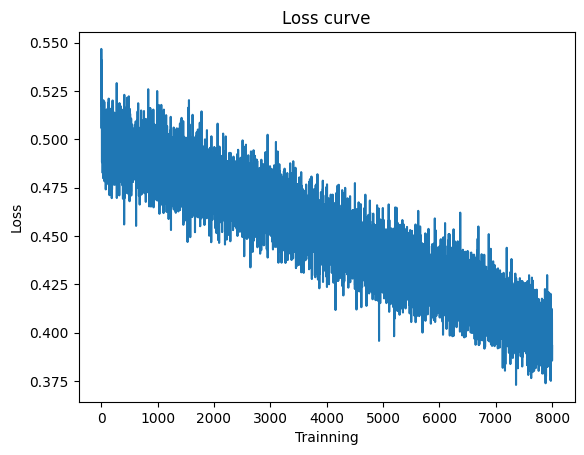
    


    
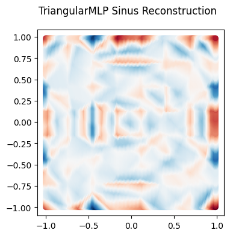
    


```python

```

# Result of the 2D signal approximation,  hard version


```python
#hard data
(data,label) = create_dataset_hard(size=128)
show_data(data,label,5,size=128)
```


    

    


```python
model = simple_mlp_Helmholtz()
train_model(model,create_dataset_hard(),epochs=500,plot_step=50)
reconstruct_Helmholtz(model,index=1,title="SimpleMLP Sinus Reconstruction")
print(model)
```

    Epoch: 1, Loss_train: 0.508 
    Epoch: 51, Loss_train: 0.313 
    Epoch: 101, Loss_train: 0.262 
    Epoch: 151, Loss_train: 0.250 
    Epoch: 201, Loss_train: 0.203 
    Epoch: 251, Loss_train: 0.203 
    Epoch: 301, Loss_train: 0.177 
    Epoch: 351, Loss_train: 0.188 
    Epoch: 401, Loss_train: 0.166 
    Epoch: 451, Loss_train: 0.165 
    Finished with a loss for 100 last loss :  0.16602142
    Finished with a loss for 50 last loss :  0.16555744
    simple_mlp_Helmholtz(
      (fc_1): Linear(in_features=2, out_features=32, bias=True)
      (fc_2): Linear(in_features=32, out_features=32, bias=True)
      (fc_3): Linear(in_features=32, out_features=1, bias=True)
    )


    
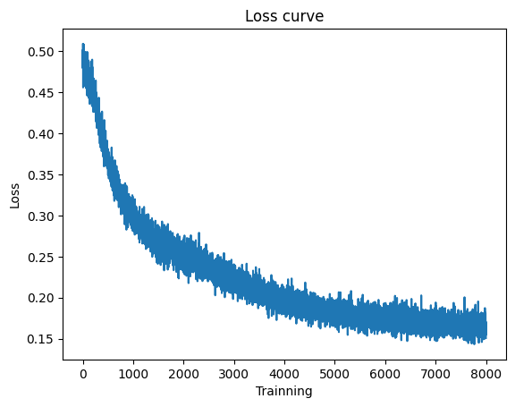
    


    
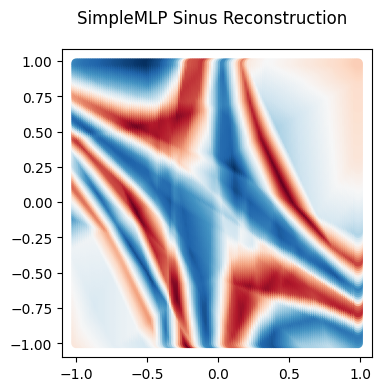
    


```python
model = fourier_mlp_Helmholtz()
train_model(model,create_dataset_hard(),epochs=500,plot_step=50)
reconstruct_Helmholtz(model,index=2,title="FourierMLP Sinus Reconstruction")
print(model)
```

    Epoch: 1, Loss_train: 0.519 
    Epoch: 51, Loss_train: 0.043 
    Epoch: 101, Loss_train: 0.045 
    Epoch: 151, Loss_train: 0.037 
    Epoch: 201, Loss_train: 0.041 
    Epoch: 251, Loss_train: 0.040 
    Epoch: 301, Loss_train: 0.038 
    Epoch: 351, Loss_train: 0.037 
    Epoch: 401, Loss_train: 0.042 
    Epoch: 451, Loss_train: 0.036 
    Finished with a loss for 100 last loss :  0.03886108
    Finished with a loss for 50 last loss :  0.038700297
    fourier_mlp_Helmholtz(
      (fourier_1): fourier_extract_full(in_features=2, out_features=81, bias=True)
      (fc_2): Linear(in_features=81, out_features=32, bias=True)
      (fc_3): Linear(in_features=32, out_features=1, bias=True)
    )


    

    


    

    


```python
model = siren_mlp_Helmholtz()
train_model(model,create_dataset_hard(),epochs=500,plot_step=50)
reconstruct_Helmholtz(model,index=4,title="SirenMLP Sinus Reconstruction")
print(model)
```

    Epoch: 1, Loss_train: 0.938 
    Epoch: 51, Loss_train: 0.044 
    Epoch: 101, Loss_train: 0.042 
    Epoch: 151, Loss_train: 0.043 
    Epoch: 201, Loss_train: 0.040 
    Epoch: 251, Loss_train: 0.040 
    Epoch: 301, Loss_train: 0.040 
    Epoch: 351, Loss_train: 0.045 
    Epoch: 401, Loss_train: 0.044 
    Epoch: 451, Loss_train: 0.041 
    Finished with a loss for 100 last loss :  0.044641916
    Finished with a loss for 50 last loss :  0.044657227
    siren_mlp_Helmholtz(
      (siren): Siren(
        (net): Sequential(
          (0): SineLayer(
            (linear): Linear(in_features=2, out_features=32, bias=True)
          )
          (1): SineLayer(
            (linear): Linear(in_features=32, out_features=32, bias=True)
          )
          (2): SineLayer(
            (linear): Linear(in_features=32, out_features=1, bias=True)
          )
        )
      )
    )


    
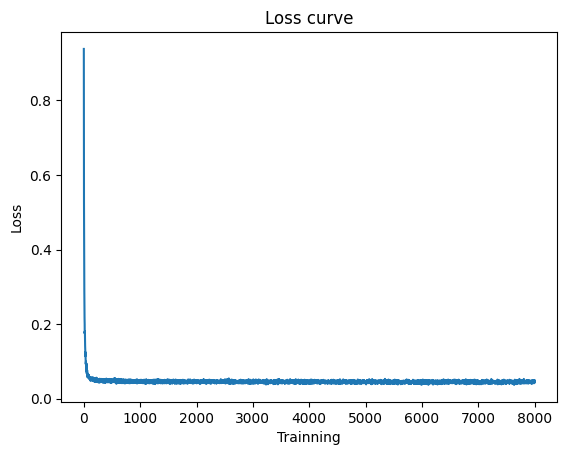
    


    
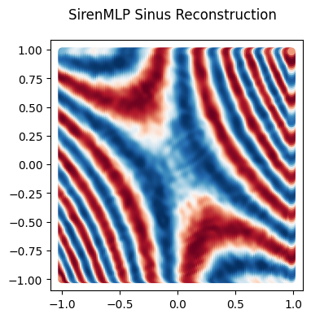
    


```python
model = triangular_mlp_Helmholtz()
train_model(model,create_dataset_hard(),epochs=500,plot_step=50)
reconstruct_Helmholtz(model,index=5,title="TriangularMLP Sinus Reconstruction")
print(model)
```

    Epoch: 1, Loss_train: 0.496 
    Epoch: 51, Loss_train: 0.334 
    Epoch: 101, Loss_train: 0.277 
    Epoch: 151, Loss_train: 0.258 
    Epoch: 201, Loss_train: 0.226 
    Epoch: 251, Loss_train: 0.214 
    Epoch: 301, Loss_train: 0.196 
    Epoch: 351, Loss_train: 0.193 
    Epoch: 401, Loss_train: 0.185 
    Epoch: 451, Loss_train: 0.185 
    Finished with a loss for 100 last loss :  0.17553586
    Finished with a loss for 50 last loss :  0.17520744
    triangular_mlp_Helmholtz(
      (input_decompo): triangular_features_extraction(in_features=2, out_features=16, bias=True)
      (fc_1): Linear(in_features=16, out_features=32, bias=True)
      (fc_2): Linear(in_features=32, out_features=1, bias=True)
    )


    
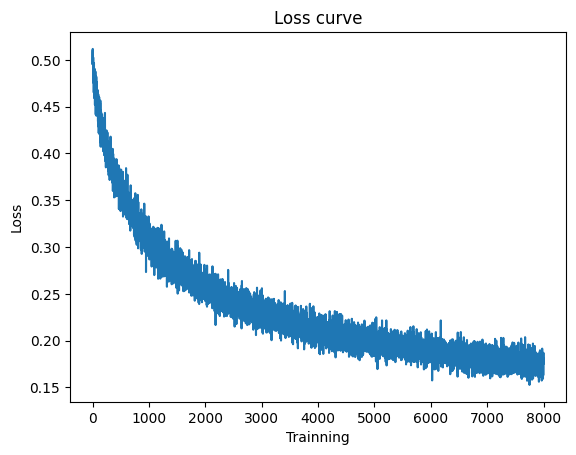
    


    

    


```python

```


```python

```


```python

```


```python

```
