# Signal Approximation by neural network

We will reproduce some experiment of the paper "Implicit Neural Representations with Periodic Activation Functions" (Sitzmann, Martel et al.)
https://www.vincentsitzmann.com/siren/


```python
#import packages
import numpy as np
import cv2
from matplotlib import pyplot as plt
import torch
import random
from torch.utils.data import Dataset, DataLoader, TensorDataset
import torch.nn as nn
import torch.nn.functional as F
from itertools import product

#define device to speed up on gpu, if you can
if torch.cuda.is_available():  
  dev = "cuda:0" 
else:  
  dev = "cpu"  
#dev = "cpu"

device = torch.device(dev)  
global device
print("Device :",device)

#Utils function :
#based on a model, reconstruct the image
#create the dataset based on a image file
#warning : the loss of the image is not based on the image reconstruction but based on pixel prediction

def show_image(image,index,title="Ground truth"):
    image =(image*255.0).astype(np.uint8)
    plt.figure(index)
    plt.title(title)
    plt.imshow(cv2.cvtColor(image, cv2.COLOR_BGR2RGB))
    
def reconstruct_image(model,index=0,title="Reconstruct image"):
    size_x = 256
    size_y = 256
    channels = 3
    image = np.zeros((size_x,size_y,channels))
    
    x_channel = torch.arange(0,256)/256
    y_channel = torch.arange(0,256)/256

    x_channel = x_channel.view(-1,1)
    y_channel = y_channel.view(1,-1)

    x_channel = x_channel.repeat(1, 256)
    y_channel = y_channel.repeat(256, 1)

    x_channel = x_channel.view(-1)
    y_channel = y_channel.view(-1)


    xy_channel = torch.stack([x_channel,y_channel],dim=-1)
    raw_image = model(xy_channel).cpu()
    image = torch.reshape(raw_image, (size_x,size_y,3)).detach().numpy()


    show_image(image,index,title)
    
def create_dataset(image):#dataset with r,g,b in [0,1]
    size_x = image.shape[0]
    size_y = image.shape[1]
    channels = image.shape[2]
    
    x_data = np.zeros((size_x*size_y,2))
    y_labels = np.zeros((size_x*size_y,channels))
    for i in range(size_x):
        for j in range(size_y):
            x_ = i/size_x
            y_ = j/size_y
            #print([x_,y_])
            #print(y_labels.shape)
            x_data[i*size_y+j] = [x_,y_]
            y_labels[i*size_y+j] = image[i][j]/255.0
    return x_data,y_labels


#The models to predict, based on the data (coordinate (x,y)), the label (pixel (r,g,b))

#by Vincent Sitzmann, Implicit Neural Representations with Periodic Activation Functions
#https://www.vincentsitzmann.com/siren/
class SineLayer(nn.Module):

    def __init__(self, in_features, out_features, bias=True,
                 is_first=False, omega_0=30):
        super().__init__()
        self.omega_0 = omega_0
        self.is_first = is_first
        
        self.in_features = in_features
        self.linear = nn.Linear(in_features, out_features, bias=bias).to(device)
        
        self.init_weights()
    
    def init_weights(self):
        with torch.no_grad():
            if self.is_first:
                self.linear.weight.uniform_(-1 / self.in_features, 
                                             1 / self.in_features)      
            else:
                self.linear.weight.uniform_(-np.sqrt(6 / self.in_features) / self.omega_0, 
                                             np.sqrt(6 / self.in_features) / self.omega_0)
        
    def forward(self, input):
        return torch.sin(self.omega_0 * self.linear(input))
    
class Siren(nn.Module):
    def __init__(self, in_features, hidden_features, hidden_layers, out_features, outermost_linear=False, 
                 first_omega_0=30, hidden_omega_0=30.):
        super().__init__()
        
        self.net = []
        self.net.append(SineLayer(in_features, hidden_features, 
                                  is_first=True, omega_0=first_omega_0))

        for i in range(hidden_layers):
            self.net.append(SineLayer(hidden_features, hidden_features, 
                                      is_first=False, omega_0=hidden_omega_0))

        if outermost_linear:
            final_linear = nn.Linear(hidden_features, out_features)
            
            with torch.no_grad():
                final_linear.weight.uniform_(-np.sqrt(6 / hidden_features) / hidden_omega_0, 
                                              np.sqrt(6 / hidden_features) / hidden_omega_0)
                
            self.net.append(final_linear)
        else:
            self.net.append(SineLayer(hidden_features, out_features, 
                                      is_first=False, omega_0=hidden_omega_0))
        
        self.net = nn.Sequential(*self.net)
    
    def forward(self, coords):
        coords = coords.to(device)
        coords = coords.clone().detach().requires_grad_(True) # allows to take derivative w.r.t. input
        output = self.net(coords)
        return output#, coords        

    def forward_with_activations(self, coords, retain_grad=False):
        '''Returns not only model output, but also intermediate activations.
        Only used for visualizing activations later!'''
        activations = OrderedDict()

        activation_count = 0
        x = coords.clone().detach().requires_grad_(True)
        activations['input'] = x
        for i, layer in enumerate(self.net):
            if isinstance(layer, SineLayer):
                x, intermed = layer.forward_with_intermediate(x)
                
                if retain_grad:
                    x.retain_grad()
                    intermed.retain_grad()
                    
                activations['_'.join((str(layer.__class__), "%d" % activation_count))] = intermed
                activation_count += 1
            else: 
                x = layer(x)
                
                if retain_grad:
                    x.retain_grad()
                    
            activations['_'.join((str(layer.__class__), "%d" % activation_count))] = x
            activation_count += 1

        return activations
    
    
#based on David Brellmann, "Fourier Features in Reinforcement Learning with Neural Networks"
#https://openreview.net/forum?id=VO7bAwdWRjg
class fourier_extract_full(nn.Linear):
    def __init__(self, in_features:int, order:int):
        self.order = order
        self.in_features = in_features
        super().__init__(in_features, (order+1)**in_features, bias=True)
        c=np.array(list(product(range(order + 1), repeat=in_features)))
        with torch.no_grad():
            self.weight.copy_(torch.tensor(c, dtype=torch.float32))
        self.weight.requires_grad = False

    def get_output_size(self,):
        return (self.order+1)**self.in_features

    def forward(self, x:torch.Tensor)->torch.Tensor:
        ##print(x.size())
        x = x.to(device)
        x = np.pi*super().forward(x)
        return torch.cos(x)
    
    
#code by me
class simple_mlp(nn.Module):
    def __init__(self,):
        super(simple_mlp, self).__init__()
        self.fc_1 = nn.Linear(2,64).to(device)
        self.fc_2 = nn.Linear(64,64).to(device)
        self.fc_3 = nn.Linear(64,3).to(device)

    def forward(self, x):
        x = x.to(device)
        x = F.relu(self.fc_1(x))
        x = F.relu(self.fc_2(x))
        x = self.fc_3(x)
        return x
    
#code by me, based on fourier_extract_full
class fourier_mlp(nn.Module):
    def __init__(self,):
        super(fourier_mlp, self).__init__()
        self.fourier_1 = fourier_extract_full(2,8).to(device)
        self.fc_2 = nn.Linear(self.fourier_1.get_output_size(),64).to(device)
        self.fc_3 = nn.Linear(64,64).to(device)
        self.fc_4 = nn.Linear(64,3).to(device)

    def forward(self, x):
        x = x.to(device)
        x = self.fourier_1(x)
        x = F.relu(self.fc_2(x))
        x = F.relu(self.fc_3(x))
        x = self.fc_4(x)
        return x
    
#code by me, based on Siren
class siren_mlp(nn.Module):
    def __init__(self,):
        super(siren_mlp, self).__init__()
        #sorry for this litle trick, the original paper predict only one value
        self.siren_r = Siren(in_features=2, out_features=1, hidden_features=64, hidden_layers=1, outermost_linear=True).to(device)
        self.siren_g = Siren(in_features=2, out_features=1, hidden_features=64, hidden_layers=1, outermost_linear=True).to(device)
        self.siren_b = Siren(in_features=2, out_features=1, hidden_features=64, hidden_layers=1, outermost_linear=True).to(device)

    def forward(self,x):
        x = x.to(device)
        return torch.cat([self.siren_r(x),self.siren_g(x),self.siren_b(x),],dim=-1)
    
    
#code by me
class triangular_features_extraction(nn.Linear):
    def __init__(self, in_features:int, order:int,flatten=True):
        self.flatten = flatten
        self.order = order
        self.in_features = in_features
        self.size_ecart = 1/(self.order-1)
        self.var_power = 2.0
        
        self.size_pic = self.var_power*self.size_ecart

        super().__init__(in_features, (order)*in_features, bias=True)


    def forward(self, x:torch.Tensor)->torch.Tensor:
        x = x.type(torch.float64).to(device)
        out= torch.zeros(x.shape[0],x.shape[1],self.order).to(device)

        
        for i in range(self.order):
            out[:,:,i] = x-i*self.size_ecart
        mean = self.size_pic
        out = torch.min(torch.relu(out+self.size_pic),torch.relu(self.size_pic-out)).to(device)/(self.size_pic)
        
        
        if self.flatten:
            return torch.flatten(out, start_dim=1)
        else:
            return out#torch.flatten(out, start_dim=1)

#code by me
class triangular_mlp(nn.Module):
    def __init__(self,):
        super(triangular_mlp, self).__init__()
        self.triangular_extraction = triangular_features_extraction(2,8).to(device)
        self.fc_1 = nn.Linear(16,64).to(device)
        self.fc_2 = nn.Linear(64,3).to(device)
        #self.fc_3 = nn.Linear(64,3).to(device)

    def forward(self, x):
        x = x.to(device)
        x = self.triangular_extraction(x)
        x = F.relu(self.fc_1(x))
        #x = F.relu(self.fc_2(x))
        x = self.fc_2(x)
        return x
        
#we define the trainning loop
def train_model(
    model=simple_mlp(),
    dataset=create_dataset(cv2.imread("lena.png")),
    epochs=10,
    plot_step=1,
    ):
    loss_func = torch.nn.MSELoss()
    dataset = TensorDataset( torch.Tensor(dataset[0]), torch.Tensor(dataset[1]) )
    dataloader = DataLoader(dataset, batch_size=1024, shuffle=True)
    optimizer = torch.optim.Adam(model.parameters(), lr=0.001)
    loss_array = []


    for epoch in range(epochs):

        for id_batch, (inputs, labels) in enumerate(dataloader):
                optimizer.zero_grad()
                labels_predict = model(inputs).cpu()
                loss_train = loss_func(labels_predict, labels)
                loss_train.backward()
                optimizer.step()
                loss_array.append(loss_train.detach().numpy())
                #print(id_batch)
                if id_batch==0:
                    if epoch%plot_step==0:
                        print('Epoch: %d, Loss_train: %.3f ' % (epoch+1, loss_train))
    plt.figure(42)
    plt.title("Loss curve")
    plt.xlabel("Trainning")
    plt.ylabel("Loss")
    plt.plot(loss_array)
    print("Finished with a loss for 100 last loss : ",np.mean(loss_array[-100:]))
    print("Finished with a loss for 50 last loss : ",np.mean(loss_array[-50:]))
    


```

    Device : cuda:0


# We will benchmark different way to extract the data to obtain the pixel prediction

The extraction :


```python
layer = triangular_features_extraction(100,8,flatten=False)
input_x = torch.arange(0,100)/100
input_x = input_x.view(1,-1)
output_y = layer(input_x).cpu()
plt.title("Triangular extraction visualization")
plt.plot(output_y[0])

```


    [<matplotlib.lines.Line2D at 0x7f460c200970>,
     <matplotlib.lines.Line2D at 0x7f460c2009d0>,
     <matplotlib.lines.Line2D at 0x7f460c200a00>,
     <matplotlib.lines.Line2D at 0x7f460c200b20>,
     <matplotlib.lines.Line2D at 0x7f460c200c10>,
     <matplotlib.lines.Line2D at 0x7f460c200d00>,
     <matplotlib.lines.Line2D at 0x7f460c200df0>,
     <matplotlib.lines.Line2D at 0x7f460c200ee0>]


    
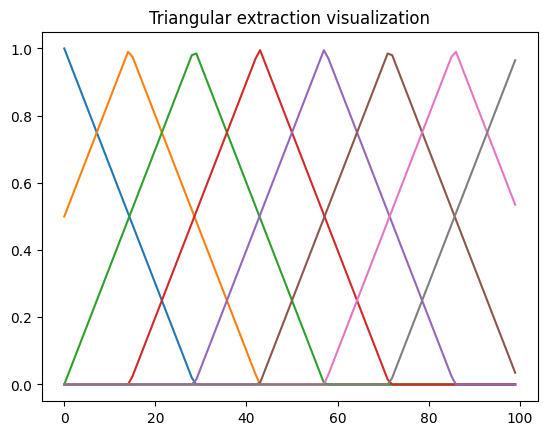
    


```python
layer = fourier_extract_full(1,4).to(device)

input_x = torch.arange(0,100)/100
input_x = input_x.view(1,-1,1).to(device)
print(input_x.shape)
output_y = layer(input_x).cpu()
plt.title("Fourier feature extraction visualization")
plt.plot(output_y[0].detach().numpy())
```

    torch.Size([1, 100, 1])


    [<matplotlib.lines.Line2D at 0x7f460c1350a0>,
     <matplotlib.lines.Line2D at 0x7f460c135100>,
     <matplotlib.lines.Line2D at 0x7f460c135130>,
     <matplotlib.lines.Line2D at 0x7f460c135220>,
     <matplotlib.lines.Line2D at 0x7f460c135310>]


    
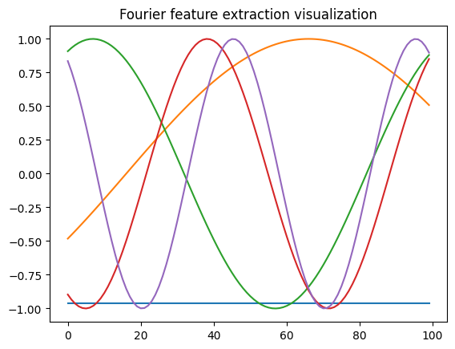
    


```python
layer = SineLayer(1,4).to(device)

input_x = torch.arange(0,100)/100
input_x = input_x.view(1,-1,1).to(device)
print(input_x.shape)
output_y = layer(input_x).cpu()
plt.title("Siren extraction visualization")
plt.plot(output_y[0].detach().numpy())
```

    torch.Size([1, 100, 1])


    [<matplotlib.lines.Line2D at 0x7f460c0433d0>,
     <matplotlib.lines.Line2D at 0x7f460c043430>,
     <matplotlib.lines.Line2D at 0x7f460c043460>,
     <matplotlib.lines.Line2D at 0x7f460c043550>]


    

    


The test of the model :


```python
#Verify all model and show data
model = simple_mlp()
reconstruct_image(model,1,"SimpleMlp Image Reconstruct")

model = fourier_mlp()
reconstruct_image(model,2,"FourierMlp Image Reconstruct")

model = siren_mlp()
reconstruct_image(model,3,"SirenMlp Reconstruct")

model = triangular_mlp()
reconstruct_image(model,4,"TriangularMlp Reconstruct")


```


    
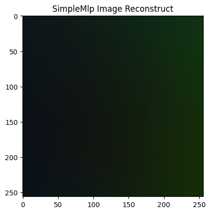
    


    

    


    
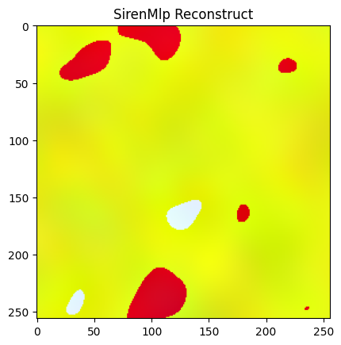
    


    
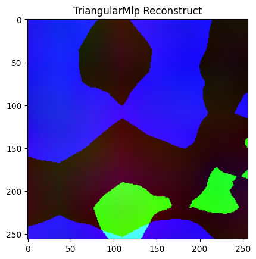
    


The data :


```python
show_image(cv2.imread("lena.png")/255.0,5)
```


    

    


# Result of the image prediction


```python
model = simple_mlp()
train_model(model)
reconstruct_image(model,1,"SimpleMlp Image Reconstruct")
print(model)
```

    Epoch: 1, Loss_train: 0.341 
    Epoch: 2, Loss_train: 0.029 
    Epoch: 3, Loss_train: 0.027 
    Epoch: 4, Loss_train: 0.025 
    Epoch: 5, Loss_train: 0.025 
    Epoch: 6, Loss_train: 0.025 
    Epoch: 7, Loss_train: 0.023 
    Epoch: 8, Loss_train: 0.020 
    Epoch: 9, Loss_train: 0.021 
    Epoch: 10, Loss_train: 0.018 
    Finished with a loss for 100 last loss :  0.01764439
    Finished with a loss for 50 last loss :  0.017491633
    simple_mlp(
      (fc_1): Linear(in_features=2, out_features=64, bias=True)
      (fc_2): Linear(in_features=64, out_features=64, bias=True)
      (fc_3): Linear(in_features=64, out_features=3, bias=True)
    )


    
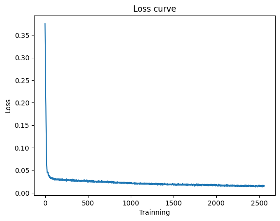
    


    
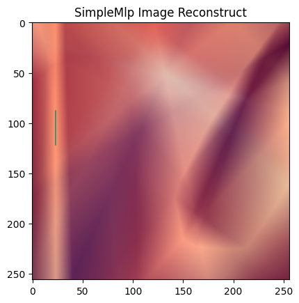
    


```python
model = fourier_mlp()
train_model(model)
reconstruct_image(model,2,"FourierMlp Reconstruct")
print(model)
```

    Epoch: 1, Loss_train: 0.323 
    Epoch: 2, Loss_train: 0.009 
    Epoch: 3, Loss_train: 0.008 
    Epoch: 4, Loss_train: 0.006 
    Epoch: 5, Loss_train: 0.005 
    Epoch: 6, Loss_train: 0.005 
    Epoch: 7, Loss_train: 0.005 
    Epoch: 8, Loss_train: 0.003 
    Epoch: 9, Loss_train: 0.004 
    Epoch: 10, Loss_train: 0.004 
    Finished with a loss for 100 last loss :  0.0036257422
    Finished with a loss for 50 last loss :  0.0036042777
    fourier_mlp(
      (fourier_1): fourier_extract_full(in_features=2, out_features=81, bias=True)
      (fc_2): Linear(in_features=81, out_features=64, bias=True)
      (fc_3): Linear(in_features=64, out_features=64, bias=True)
      (fc_4): Linear(in_features=64, out_features=3, bias=True)
    )


    
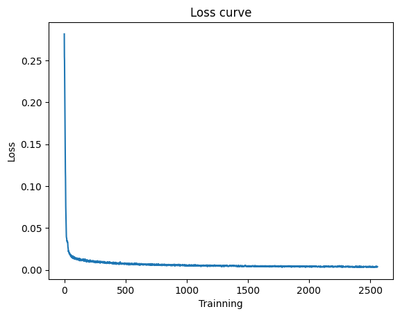
    


    

    


```python
model = siren_mlp()
train_model(model)
reconstruct_image(model,4,"SirenMlp Reconstruct")
print(model)
```

    Epoch: 1, Loss_train: 0.258 
    Epoch: 2, Loss_train: 0.007 
    Epoch: 3, Loss_train: 0.006 
    Epoch: 4, Loss_train: 0.006 
    Epoch: 5, Loss_train: 0.005 
    Epoch: 6, Loss_train: 0.004 
    Epoch: 7, Loss_train: 0.006 
    Epoch: 8, Loss_train: 0.005 
    Epoch: 9, Loss_train: 0.005 
    Epoch: 10, Loss_train: 0.005 
    Finished with a loss for 100 last loss :  0.0047893906
    Finished with a loss for 50 last loss :  0.0048426916
    siren_mlp(
      (siren_r): Siren(
        (net): Sequential(
          (0): SineLayer(
            (linear): Linear(in_features=2, out_features=64, bias=True)
          )
          (1): SineLayer(
            (linear): Linear(in_features=64, out_features=64, bias=True)
          )
          (2): Linear(in_features=64, out_features=1, bias=True)
        )
      )
      (siren_g): Siren(
        (net): Sequential(
          (0): SineLayer(
            (linear): Linear(in_features=2, out_features=64, bias=True)
          )
          (1): SineLayer(
            (linear): Linear(in_features=64, out_features=64, bias=True)
          )
          (2): Linear(in_features=64, out_features=1, bias=True)
        )
      )
      (siren_b): Siren(
        (net): Sequential(
          (0): SineLayer(
            (linear): Linear(in_features=2, out_features=64, bias=True)
          )
          (1): SineLayer(
            (linear): Linear(in_features=64, out_features=64, bias=True)
          )
          (2): Linear(in_features=64, out_features=1, bias=True)
        )
      )
    )


    

    


    

    


```python
model = triangular_mlp()
train_model(model)
reconstruct_image(model,4,"TriangularMlp Reconstruct")
print(model)

```

    Epoch: 1, Loss_train: 0.284 
    Epoch: 2, Loss_train: 0.022 
    Epoch: 3, Loss_train: 0.020 
    Epoch: 4, Loss_train: 0.017 
    Epoch: 5, Loss_train: 0.016 
    Epoch: 6, Loss_train: 0.014 
    Epoch: 7, Loss_train: 0.013 
    Epoch: 8, Loss_train: 0.011 
    Epoch: 9, Loss_train: 0.012 
    Epoch: 10, Loss_train: 0.011 
    Finished with a loss for 100 last loss :  0.011186038
    Finished with a loss for 50 last loss :  0.011115678
    triangular_mlp(
      (triangular_extraction): triangular_features_extraction(in_features=2, out_features=16, bias=True)
      (fc_1): Linear(in_features=16, out_features=64, bias=True)
      (fc_2): Linear(in_features=64, out_features=3, bias=True)
    )


    
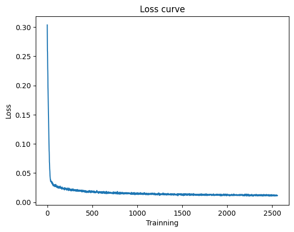
    


    

    


# After the image reconstruction, the 2D signal reconstruction :

### 


```python

def show_data(data,labels,index,title="Ground truth",size=128):
    X,Y,Z = data[:,0],data[:,1],labels

    X = np.reshape(X,(size,size))
    Y = np.reshape(Y,(size,size))
    Z = np.reshape(Z,(size,size))
    
    fig = plt.figure(index,figsize=(4, 4))
    #plt.title(title)
    fig.suptitle(title)
    ax = fig.add_subplot()
    scats = ax.scatter(X,Y,c=Z, cmap = "RdBu")#RdBu
    #fig.colorbar(scats)
    
def reconstruct_Helmholtz(model,index=1,title="Reconstruct image",size=128):
    size_x = size
    size_y = size
    channels = 1
    
    
    image = np.zeros((size_x,size_y,channels))
    x_channel = (torch.arange(0,size_x)/size_x)*2 -1
    y_channel = (torch.arange(0,size_y)/size_y)*2 -1
    x_channel = x_channel.view(-1,1)
    y_channel = y_channel.view(1,-1)
    x_channel = x_channel.repeat(1, size_x)
    y_channel = y_channel.repeat(size_y, 1)

    x_channel = x_channel.view(-1)
    y_channel = y_channel.view(-1)


    xy_channel = torch.stack([x_channel,y_channel],dim=-1)
    raw_image = model(xy_channel).cpu()

    show_data(xy_channel.detach(),raw_image.detach(),index,title,size)
    
    

def create_dataset_Helmholtz(size=128,size_sin=4):
    size_x=size
    size_y=size
    x_data = np.zeros((size_x*size_y,2))
    y_labels = np.zeros((size_x*size_y,1))
    for i in range(size_x):
        for j in range(size_y):
            x_ = (i/size_x)*2-1
            y_ = (j/size_y)*2-1

            x_data[i*size_y+j] = [x_,y_]
            R = np.sqrt((x_)**2 + y_**2)
            y_labels[i*size_y+j] = np.sin(R*3.1415*size_sin) 
    return x_data,y_labels
def create_dataset_Helmholtz_max(size=128):
    return create_dataset_Helmholtz(size=128,size_sin=10)


def create_dataset_hard(size=128):
    size_x=size
    size_y=size
    x_data = np.zeros((size_x*size_y,2))
    y_labels = np.zeros((size_x*size_y,1))
    for i in range(size_x):
        for j in range(size_y):
            x_ = (i/size_x)*2-1
            y_ = (j/size_y)*2-1

            x_data[i*size_y+j] = [x_,y_]
            y_labels[i*size_y+j] = np.sin(3.1415*(2*x_+3*y_)*2*x_+random.random())
            
            
    return x_data,y_labels


```

The 2D signal to Reconstruct :


```python
(data,label) = create_dataset_Helmholtz(size=128)
show_data(data,label,1,size=128)
```


    

    


To solve this task, we can choose between 2 types of neural network :

    minimal : Obtain reconstruction with the smaller model to see the benefits and limits of each way to extract the data
    maximal : Obtain a reconstruction with the higher accuracy (with bigger model), to test the model on harder task after that


```python
#Minimal neural network
class simple_mlp_Helmholtz(nn.Module):
    def __init__(self,):
        super(simple_mlp_Helmholtz, self).__init__()
        self.fc_1 = nn.Linear(2,32).to(device)
        self.fc_2 = nn.Linear(32,1).to(device)
    def forward(self, x):
        x = x.to(device)
        x = F.relu(self.fc_1(x))
        x = self.fc_2(x)
        return x
    
class triangular_mlp_Helmholtz(nn.Module):
    def __init__(self,):
        super(triangular_mlp_Helmholtz, self).__init__()
        self.input_decompo = triangular_features_extraction(2,8).to(device)
        self.fc_1 = nn.Linear(16,1).to(device)
        #self.fc_2 = nn.Linear(32,1).to(device)


    def forward(self, x):
        x = x.to(device)
        x = self.input_decompo((x+1)/2)
        #x = F.relu(self.fc_1(x))
        x = self.fc_1(x)
        return x
#code by me
class fourier_mlp_Helmholtz(nn.Module):
    def __init__(self,):
        super(fourier_mlp_Helmholtz, self).__init__()
        self.fourier_1 = fourier_extract_full(2,4).to(device)
        self.fc_2 = nn.Linear(self.fourier_1.get_output_size(),1).to(device)
        #self.fc_3 = nn.Linear(64,1).to(device)


    def forward(self, x):
        x = x.to(device)
        x = self.fourier_1(x)
        #x = F.relu(self.fc_2(x))
        x = self.fc_2(x)
        return x
    
#code by me
class siren_mlp_Helmholtz(nn.Module):
    def __init__(self,):
        super(siren_mlp_Helmholtz, self).__init__()
        self.siren = Siren(in_features=2, out_features=1, hidden_features=16, hidden_layers=0, outermost_linear=False).to(device)

    def forward(self,x):
        x = x.to(device)
        return self.siren(x)
    

```


```python
#Normal model
class simple_mlp_Helmholtz(nn.Module):
    def __init__(self,):
        super(simple_mlp_Helmholtz, self).__init__()
        self.fc_1 = nn.Linear(2,32).to(device)
        self.fc_2 = nn.Linear(32,32).to(device)
        self.fc_3 = nn.Linear(32,1).to(device)
    def forward(self, x):
        x = x.to(device)
        x = F.relu(self.fc_1(x))
        x = F.relu(self.fc_2(x))
        x = self.fc_3(x)
        return x
    
class siren_fake_mlp_Helmholtz(nn.Module):
    def __init__(self,):
        super(siren_fake_mlp_Helmholtz, self).__init__()
        self.fc_1 = nn.Linear(2,32).to(device)
        self.fc_2 = nn.Linear(32,32).to(device)
        self.fc_3 = nn.Linear(32,1).to(device)
    def forward(self, x):
        x = x.to(device)
        x = torch.sin(self.fc_1(x))
        x = torch.sin(self.fc_2(x))
        x = self.fc_3(x)
        return x
    
class triangular_mlp_Helmholtz(nn.Module):
    def __init__(self,):
        super(triangular_mlp_Helmholtz, self).__init__()
        self.input_decompo = triangular_features_extraction(2,8).to(device)
        self.fc_1 = nn.Linear(16,32).to(device)
        self.fc_2 = nn.Linear(32,1).to(device)


    def forward(self, x):
        x = x.to(device)
        x = self.input_decompo((x+1)/2)
        x = F.relu(self.fc_1(x))
        x = self.fc_2(x)
        return x
    
    
#code by me
class fourier_mlp_Helmholtz(nn.Module):
    def __init__(self,):
        super(fourier_mlp_Helmholtz, self).__init__()
        self.fourier_1 = fourier_extract_full(2,8).to(device)
        self.fc_2 = nn.Linear(self.fourier_1.get_output_size(),32).to(device)
        self.fc_3 = nn.Linear(32,1).to(device)


    def forward(self, x):
        x = x.to(device)
        x = self.fourier_1(x)
        x = F.relu(self.fc_2(x))
        x = self.fc_3(x)
        return x
    
#code by me
class siren_mlp_Helmholtz(nn.Module):
    def __init__(self,):
        super(siren_mlp_Helmholtz, self).__init__()
        self.siren = Siren(in_features=2, out_features=1, hidden_features=32, hidden_layers=1, outermost_linear=False).to(device)

    def forward(self,x):
        x = x.to(device)
        return self.siren(x)
    
```


```python
#Verify models and data 
model = simple_mlp_Helmholtz()
reconstruct_Helmholtz(model,index=1)

model = fourier_mlp_Helmholtz()
reconstruct_Helmholtz(model,index=2)

model = siren_mlp_Helmholtz()
reconstruct_Helmholtz(model,index=3)

model = triangular_mlp_Helmholtz()
reconstruct_Helmholtz(model,index=4)


(data,label) = create_dataset_Helmholtz(size=128)
show_data(data,label,5,size=128)

```


    

    


    
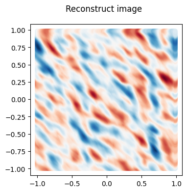
    


    

    


    

    


    

    


# Result of the 2D signal approximation, easy version


```python
#Simple data
(data,label) = create_dataset_Helmholtz(size=128)
show_data(data,label,5,size=128)
```


    

    


```python
model = simple_mlp_Helmholtz()
train_model(model,create_dataset_Helmholtz(),epochs=500,plot_step=50)
reconstruct_Helmholtz(model,index=1,title="SimpleMLP Sinus Reconstruction")
print(model)
```

    Epoch: 1, Loss_train: 0.489 
    Epoch: 51, Loss_train: 0.348 
    Epoch: 101, Loss_train: 0.229 
    Epoch: 151, Loss_train: 0.160 
    Epoch: 201, Loss_train: 0.111 
    Epoch: 251, Loss_train: 0.101 
    Epoch: 301, Loss_train: 0.082 
    Epoch: 351, Loss_train: 0.074 
    Epoch: 401, Loss_train: 0.047 
    Epoch: 451, Loss_train: 0.050 
    Finished with a loss for 100 last loss :  0.03882
    Finished with a loss for 50 last loss :  0.038439568
    simple_mlp_Helmholtz(
      (fc_1): Linear(in_features=2, out_features=32, bias=True)
      (fc_2): Linear(in_features=32, out_features=32, bias=True)
      (fc_3): Linear(in_features=32, out_features=1, bias=True)
    )


    

    


    
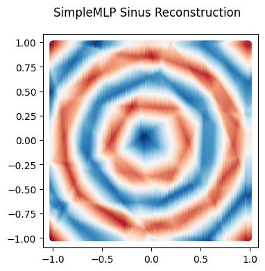
    


```python
model = siren_fake_mlp_Helmholtz()
train_model(model,create_dataset_Helmholtz(),epochs=500,plot_step=50)
reconstruct_Helmholtz(model,index=1,title="SirenFakeMLP Sinus Reconstruction")
print(model)
```

    Epoch: 1, Loss_train: 0.517 
    Epoch: 51, Loss_train: 0.489 
    Epoch: 101, Loss_train: 0.481 
    Epoch: 151, Loss_train: 0.460 
    Epoch: 201, Loss_train: 0.494 
    Epoch: 251, Loss_train: 0.450 
    Epoch: 301, Loss_train: 0.465 
    Epoch: 351, Loss_train: 0.478 
    Epoch: 401, Loss_train: 0.477 
    Epoch: 451, Loss_train: 0.446 
    Finished with a loss for 100 last loss :  0.41039258
    Finished with a loss for 50 last loss :  0.40893042
    siren_fake_mlp_Helmholtz(
      (fc_1): Linear(in_features=2, out_features=32, bias=True)
      (fc_2): Linear(in_features=32, out_features=32, bias=True)
      (fc_3): Linear(in_features=32, out_features=1, bias=True)
    )


    
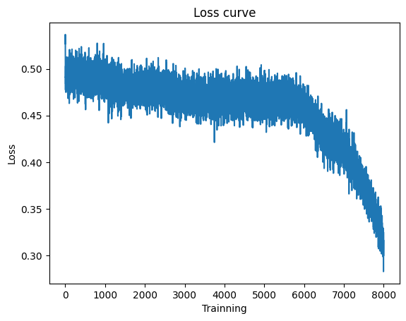
    


    
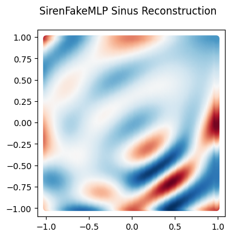
    


```python

model = fourier_mlp_Helmholtz()
train_model(model,create_dataset_Helmholtz(),epochs=500,plot_step=50)
reconstruct_Helmholtz(model,index=2,title="FourierMLP Sinus Reconstruction")
print(model)
```

    Epoch: 1, Loss_train: 0.589 
    Epoch: 51, Loss_train: 0.001 
    Epoch: 101, Loss_train: 0.001 
    Epoch: 151, Loss_train: 0.000 
    Epoch: 201, Loss_train: 0.000 
    Epoch: 251, Loss_train: 0.000 
    Epoch: 301, Loss_train: 0.000 
    Epoch: 351, Loss_train: 0.000 
    Epoch: 401, Loss_train: 0.000 
    Epoch: 451, Loss_train: 0.000 
    Finished with a loss for 100 last loss :  0.00026814052
    Finished with a loss for 50 last loss :  0.00026567047
    fourier_mlp_Helmholtz(
      (fourier_1): fourier_extract_full(in_features=2, out_features=81, bias=True)
      (fc_2): Linear(in_features=81, out_features=32, bias=True)
      (fc_3): Linear(in_features=32, out_features=1, bias=True)
    )


    

    


    
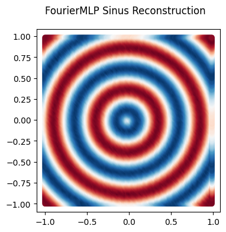
    


```python
model = siren_mlp_Helmholtz()
train_model(model,create_dataset_Helmholtz(),epochs=500,plot_step=50)
reconstruct_Helmholtz(model,index=4,title="SirenMLP Sinus Reconstruction")
print(model)
```

    Epoch: 1, Loss_train: 0.628 
    Epoch: 51, Loss_train: 0.000 
    Epoch: 101, Loss_train: 0.000 
    Epoch: 151, Loss_train: 0.000 
    Epoch: 201, Loss_train: 0.000 
    Epoch: 251, Loss_train: 0.001 
    Epoch: 301, Loss_train: 0.000 
    Epoch: 351, Loss_train: 0.000 
    Epoch: 401, Loss_train: 0.001 
    Epoch: 451, Loss_train: 0.001 
    Finished with a loss for 100 last loss :  0.0005453754
    Finished with a loss for 50 last loss :  0.0005491516
    siren_mlp_Helmholtz(
      (siren): Siren(
        (net): Sequential(
          (0): SineLayer(
            (linear): Linear(in_features=2, out_features=32, bias=True)
          )
          (1): SineLayer(
            (linear): Linear(in_features=32, out_features=32, bias=True)
          )
          (2): SineLayer(
            (linear): Linear(in_features=32, out_features=1, bias=True)
          )
        )
      )
    )


    

    


    

    


```python
model = triangular_mlp_Helmholtz()
train_model(model,create_dataset_Helmholtz(),epochs=500,plot_step=50)
reconstruct_Helmholtz(model,index=5,title="TriangularMLP Sinus Reconstruction")
print(model)
```

    Epoch: 1, Loss_train: 0.570 
    Epoch: 51, Loss_train: 0.163 
    Epoch: 101, Loss_train: 0.034 
    Epoch: 151, Loss_train: 0.021 
    Epoch: 201, Loss_train: 0.014 
    Epoch: 251, Loss_train: 0.010 
    Epoch: 301, Loss_train: 0.009 
    Epoch: 351, Loss_train: 0.007 
    Epoch: 401, Loss_train: 0.006 
    Epoch: 451, Loss_train: 0.006 
    Finished with a loss for 100 last loss :  0.006258954
    Finished with a loss for 50 last loss :  0.006262303
    triangular_mlp_Helmholtz(
      (input_decompo): triangular_features_extraction(in_features=2, out_features=16, bias=True)
      (fc_1): Linear(in_features=16, out_features=32, bias=True)
      (fc_2): Linear(in_features=32, out_features=1, bias=True)
    )


    
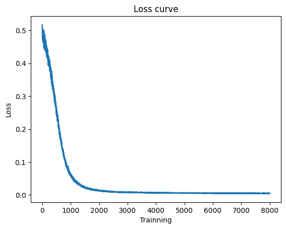
    


    

    


# Result of the 2D signal approximation,  moderate version


```python
#moderate data
(data,label) = create_dataset_Helmholtz_max(size=128)
show_data(data,label,5,size=128)
```


    

    


```python
model = simple_mlp_Helmholtz()
train_model(model,create_dataset_Helmholtz_max(),epochs=500,plot_step=50)
reconstruct_Helmholtz(model,index=1,title="SimpleMLP Sinus Reconstruction")
print(model)
```

    Epoch: 1, Loss_train: 0.506 
    Epoch: 51, Loss_train: 0.488 
    Epoch: 101, Loss_train: 0.508 
    Epoch: 151, Loss_train: 0.482 
    Epoch: 201, Loss_train: 0.476 
    Epoch: 251, Loss_train: 0.479 
    Epoch: 301, Loss_train: 0.473 
    Epoch: 351, Loss_train: 0.476 
    Epoch: 401, Loss_train: 0.467 
    Epoch: 451, Loss_train: 0.468 
    Finished with a loss for 100 last loss :  0.4520892
    Finished with a loss for 50 last loss :  0.4520489
    simple_mlp_Helmholtz(
      (fc_1): Linear(in_features=2, out_features=32, bias=True)
      (fc_2): Linear(in_features=32, out_features=32, bias=True)
      (fc_3): Linear(in_features=32, out_features=1, bias=True)
    )


    

    


    

    


```python
model = fourier_mlp_Helmholtz()
train_model(model,create_dataset_Helmholtz_max(),epochs=500,plot_step=50)
reconstruct_Helmholtz(model,index=2,title="FourierMLP Sinus Reconstruction")
print(model)
```

    Epoch: 1, Loss_train: 0.536 
    Epoch: 51, Loss_train: 0.018 
    Epoch: 101, Loss_train: 0.006 
    Epoch: 151, Loss_train: 0.005 
    Epoch: 201, Loss_train: 0.004 
    Epoch: 251, Loss_train: 0.004 
    Epoch: 301, Loss_train: 0.004 
    Epoch: 351, Loss_train: 0.003 
    Epoch: 401, Loss_train: 0.003 
    Epoch: 451, Loss_train: 0.003 
    Finished with a loss for 100 last loss :  0.003150604
    Finished with a loss for 50 last loss :  0.003149257
    fourier_mlp_Helmholtz(
      (fourier_1): fourier_extract_full(in_features=2, out_features=81, bias=True)
      (fc_2): Linear(in_features=81, out_features=32, bias=True)
      (fc_3): Linear(in_features=32, out_features=1, bias=True)
    )


    

    


    

    


```python
model = siren_mlp_Helmholtz()
train_model(model,create_dataset_Helmholtz_max(),epochs=500,plot_step=50)
reconstruct_Helmholtz(model,index=4,title="SirenMLP Sinus Reconstruction")
print(model)
```

    Epoch: 1, Loss_train: 1.106 
    Epoch: 51, Loss_train: 0.078 
    Epoch: 101, Loss_train: 0.062 
    Epoch: 151, Loss_train: 0.056 
    Epoch: 201, Loss_train: 0.065 
    Epoch: 251, Loss_train: 0.062 
    Epoch: 301, Loss_train: 0.073 
    Epoch: 351, Loss_train: 0.067 
    Epoch: 401, Loss_train: 0.052 
    Epoch: 451, Loss_train: 0.064 
    Finished with a loss for 100 last loss :  0.063502766
    Finished with a loss for 50 last loss :  0.06339061
    siren_mlp_Helmholtz(
      (siren): Siren(
        (net): Sequential(
          (0): SineLayer(
            (linear): Linear(in_features=2, out_features=32, bias=True)
          )
          (1): SineLayer(
            (linear): Linear(in_features=32, out_features=32, bias=True)
          )
          (2): SineLayer(
            (linear): Linear(in_features=32, out_features=1, bias=True)
          )
        )
      )
    )


    
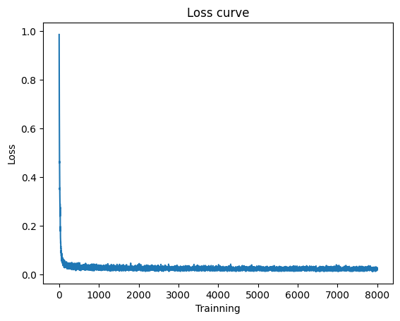
    


    

    


```python
model = triangular_mlp_Helmholtz()
train_model(model,create_dataset_Helmholtz_max(),epochs=500,plot_step=50)
reconstruct_Helmholtz(model,index=5,title="TriangularMLP Sinus Reconstruction")
print(model)
```

    Epoch: 1, Loss_train: 0.502 
    Epoch: 51, Loss_train: 0.479 
    Epoch: 101, Loss_train: 0.500 
    Epoch: 151, Loss_train: 0.478 
    Epoch: 201, Loss_train: 0.462 
    Epoch: 251, Loss_train: 0.480 
    Epoch: 301, Loss_train: 0.462 
    Epoch: 351, Loss_train: 0.434 
    Epoch: 401, Loss_train: 0.435 
    Epoch: 451, Loss_train: 0.432 
    Finished with a loss for 100 last loss :  0.42112887
    Finished with a loss for 50 last loss :  0.42075577
    triangular_mlp_Helmholtz(
      (input_decompo): triangular_features_extraction(in_features=2, out_features=16, bias=True)
      (fc_1): Linear(in_features=16, out_features=32, bias=True)
      (fc_2): Linear(in_features=32, out_features=1, bias=True)
    )


    

    


    

    


```python

```

# Result of the 2D signal approximation,  hard version


```python
#hard data
(data,label) = create_dataset_hard(size=128)
show_data(data,label,5,size=128)
```


    
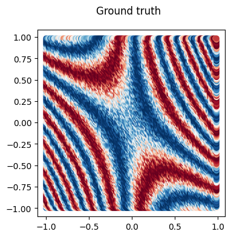
    


```python
model = simple_mlp_Helmholtz()
train_model(model,create_dataset_hard(),epochs=500,plot_step=50)
reconstruct_Helmholtz(model,index=1,title="SimpleMLP Sinus Reconstruction")
print(model)
```

    Epoch: 1, Loss_train: 0.548 
    Epoch: 51, Loss_train: 0.351 
    Epoch: 101, Loss_train: 0.294 
    Epoch: 151, Loss_train: 0.269 
    Epoch: 201, Loss_train: 0.252 
    Epoch: 251, Loss_train: 0.235 
    Epoch: 301, Loss_train: 0.219 
    Epoch: 351, Loss_train: 0.202 
    Epoch: 401, Loss_train: 0.196 
    Epoch: 451, Loss_train: 0.190 
    Finished with a loss for 100 last loss :  0.1884468
    Finished with a loss for 50 last loss :  0.18885763
    simple_mlp_Helmholtz(
      (fc_1): Linear(in_features=2, out_features=32, bias=True)
      (fc_2): Linear(in_features=32, out_features=32, bias=True)
      (fc_3): Linear(in_features=32, out_features=1, bias=True)
    )


    

    


    

    


```python
model = fourier_mlp_Helmholtz()
train_model(model,create_dataset_hard(),epochs=500,plot_step=50)
reconstruct_Helmholtz(model,index=2,title="FourierMLP Sinus Reconstruction")
print(model)
```

    Epoch: 1, Loss_train: 0.518 
    Epoch: 51, Loss_train: 0.047 
    Epoch: 101, Loss_train: 0.043 
    Epoch: 151, Loss_train: 0.043 
    Epoch: 201, Loss_train: 0.043 
    Epoch: 251, Loss_train: 0.038 
    Epoch: 301, Loss_train: 0.041 
    Epoch: 351, Loss_train: 0.036 
    Epoch: 401, Loss_train: 0.038 
    Epoch: 451, Loss_train: 0.040 
    Finished with a loss for 100 last loss :  0.03908852
    Finished with a loss for 50 last loss :  0.039071873
    fourier_mlp_Helmholtz(
      (fourier_1): fourier_extract_full(in_features=2, out_features=81, bias=True)
      (fc_2): Linear(in_features=81, out_features=32, bias=True)
      (fc_3): Linear(in_features=32, out_features=1, bias=True)
    )


    

    


    

    


```python
model = siren_mlp_Helmholtz()
train_model(model,create_dataset_hard(),epochs=500,plot_step=50)
reconstruct_Helmholtz(model,index=4,title="SirenMLP Sinus Reconstruction")
print(model)
```

    Epoch: 1, Loss_train: 0.981 
    Epoch: 51, Loss_train: 0.057 
    Epoch: 101, Loss_train: 0.058 
    Epoch: 151, Loss_train: 0.070 
    Epoch: 201, Loss_train: 0.074 
    Epoch: 251, Loss_train: 0.060 
    Epoch: 301, Loss_train: 0.066 
    Epoch: 351, Loss_train: 0.063 
    Epoch: 401, Loss_train: 0.062 
    Epoch: 451, Loss_train: 0.061 
    Finished with a loss for 100 last loss :  0.06493302
    Finished with a loss for 50 last loss :  0.06472316
    siren_mlp_Helmholtz(
      (siren): Siren(
        (net): Sequential(
          (0): SineLayer(
            (linear): Linear(in_features=2, out_features=32, bias=True)
          )
          (1): SineLayer(
            (linear): Linear(in_features=32, out_features=32, bias=True)
          )
          (2): SineLayer(
            (linear): Linear(in_features=32, out_features=1, bias=True)
          )
        )
      )
    )


    

    


    

    


```python
model = triangular_mlp_Helmholtz()
train_model(model,create_dataset_hard(),epochs=500,plot_step=50)
reconstruct_Helmholtz(model,index=5,title="TriangularMLP Sinus Reconstruction")
print(model)
```

    Epoch: 1, Loss_train: 0.484 
    Epoch: 51, Loss_train: 0.339 
    Epoch: 101, Loss_train: 0.257 
    Epoch: 151, Loss_train: 0.261 
    Epoch: 201, Loss_train: 0.218 
    Epoch: 251, Loss_train: 0.204 
    Epoch: 301, Loss_train: 0.207 
    Epoch: 351, Loss_train: 0.203 
    Epoch: 401, Loss_train: 0.180 
    Epoch: 451, Loss_train: 0.187 
    Finished with a loss for 100 last loss :  0.18025707
    Finished with a loss for 50 last loss :  0.17975438
    triangular_mlp_Helmholtz(
      (input_decompo): triangular_features_extraction(in_features=2, out_features=16, bias=True)
      (fc_1): Linear(in_features=16, out_features=32, bias=True)
      (fc_2): Linear(in_features=32, out_features=1, bias=True)
    )


    

    


    

    


```python

```


```python

```


```python

```


```python

```
